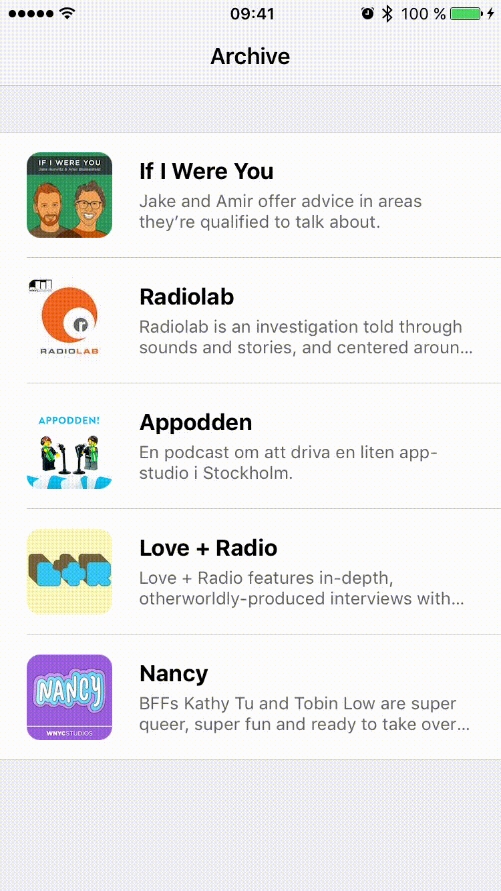

# What is Gagat?
[]()
[](https://swift.org)
[](https://github.com/Carthage/Carthage)
[](https://raw.githubusercontent.com/Boerworz/Gagat/master/LICENSE)

Gagat is a small Swift library that makes it easy to add a delightful, interactive way to switch between two different themes in your iOS application using a two-finger pan. The library was designed primarily for applications that support a "dark mode", and is heavily inspired by the Night Mode transition in [Castro 2](http://supertop.co/castro)



### What Gagat is not
Gagat is **not** a library for styling your iOS applications. You must write all the styling logic yourself without any help from Gagat, and then call your styling code from your implementation of `GagatStyleable.toggleActiveStyle()`. If you are unsure of how to implement the styling, the Example app included with Gagat showcases one way to support different themes in an application by using [configuration models](http://www.jessesquires.com/enums-as-configs/).

## Requirements
Gagat is written in Swift 3.1 and requires iOS 10.0. It cannot be used from applications written in Objective-C.

## Installation

The recommended way to install Gagat is using [Carthage](https://github.com/Carthage/Carthage). Simply add the following line to your `Cartfile`:

```
github "Boerworz/Gagat" ~> 1.0
```

If you prefer not to use a dependency managment system you can copy the swift files from the [Gagat](Gagat) directory into your project.

## Usage
To support Gagat in your iOS application there's two things you need to do (apart from `import`ing Gagat):

#### 1. Conform to `GagatStyleable`
In order for Gagat to be able to trigger the style change in your application you must provide it with an object that conforms to `GagatStyleable`. This object could be your root view controller, a specialized `StyleManager` kind of object, your app delegate, or any other object that fits your architecture.

The only requirement in the `GagatStyleable` protocol is that you implement a `toggleActiveStyle()` method. When this method is invoked you should switch to the theme that is currently inactive, e.g. switch from a light theme to a dark theme or vice versa. It's not strictly a requirement, but for the best results you should attempt to have completed the style change before you return from `toggleActiveStyle()` (i.e. avoid asynchronous calls if possible).

#### 2. Call `Gagat.configure(for:with:using:)`
This is typically done in your implementation of `application(_:didFinishLaunchingWithOptions:)` and tells Gagat to get ready to handle the interactive transition in the specified window (probably your application's only window). The second argument is your object that conforms to `GagatStyleable`.

If you want to customize properties of the transition, such as the jelly factor, pass an instance of `Gagat.Configuration` as the last argument to `Gagat.configure(for:with:using:)`, or omit it if you want to use the defaults.

**Important:** In order for Gagat to work as expected you _must_ keep a reference to the value returned by `Gagat.configure(for:with:using:)` for the entire lifetime of your application (or until you want to disable Gagat).

```swift
// AppDelegate.swift

var window: UIWindow?
var gagatTransitionHandle: Gagat.TransitionHandle!

func application(_ application: UIApplication, didFinishLaunchingWithOptions launchOptions: [UIApplicationLaunchOptionsKey: Any]?) -> Bool {
	let configuration = Gagat.Configuration(jellyFactor: 1.5)
	let styleableViewController = window!.rootViewController as! GagatStyleable
	gagatTransitionHandle = Gagat.configure(for: window!, with: styleableViewController, using: configuration)
	
	return true
}
```

#### You're done!

You should now be able to switch between your different styles by using a two-finger downwards pan from anywhere in your application.

## Running the Example app
Gagat includes an app that showcases what this library has to offer. To run the Example app, open [Gagat.xcodeproj](Gagat.xcodeproj) and run the _Gagat Example_ scheme. If you want to run the Example app on a device (you do!) then you'll need to select a team in the target settings for the _Gagat Example_ target.

#### Podcasts in the Example app
* [If I Were You](http://ifiwereyoushow.com)
* [Radiolab](http://radiolab.org)
* [Appodden](https://overcast.fm/itunes1005587579/appodden)
* [Love + Radio](http://loveandradio.org)
* [Nancy](https://www.wnyc.org/shows/nancy)

## Apps that use Gagat
If you're on your iPhone or iPad and want to try Gagat, download one of the following apps. They all use Gagat!

* [Push Me](https://pushme.jagcesar.se)

_Want your app to be listed here? Please create a pull request that adds it to the end of the list._

## Credits
The Gagat logo was created by [Johan Rothoff Andersson](http://www.johanrothoff.com).

## License

The MIT License (MIT)

Copyright 2017 Cocoabeans Software

Permission is hereby granted, free of charge, to any person obtaining a copy of this software and associated documentation files (the "Software"), to deal in the Software without restriction, including without limitation the rights to use, copy, modify, merge, publish, distribute, sublicense, and/or sell copies of the Software, and to permit persons to whom the Software is furnished to do so, subject to the following conditions:

The above copyright notice and this permission notice shall be included in all copies or substantial portions of the Software.

THE SOFTWARE IS PROVIDED "AS IS", WITHOUT WARRANTY OF ANY KIND, EXPRESS OR IMPLIED, INCLUDING BUT NOT LIMITED TO THE WARRANTIES OF MERCHANTABILITY, FITNESS FOR A PARTICULAR PURPOSE AND NONINFRINGEMENT. IN NO EVENT SHALL THE AUTHORS OR COPYRIGHT HOLDERS BE LIABLE FOR ANY CLAIM, DAMAGES OR OTHER LIABILITY, WHETHER IN AN ACTION OF CONTRACT, TORT OR OTHERWISE, ARISING FROM, OUT OF OR IN CONNECTION WITH THE SOFTWARE OR THE USE OR OTHER DEALINGS IN THE SOFTWARE.